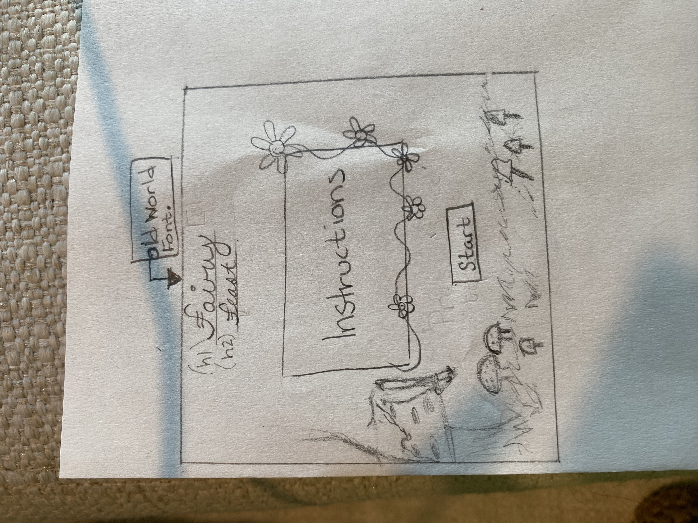
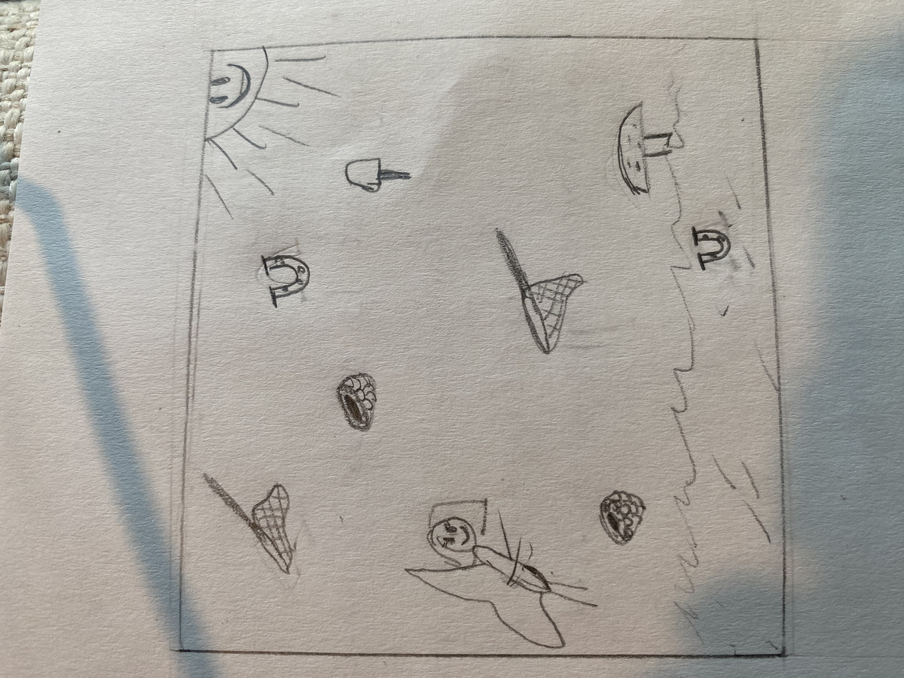
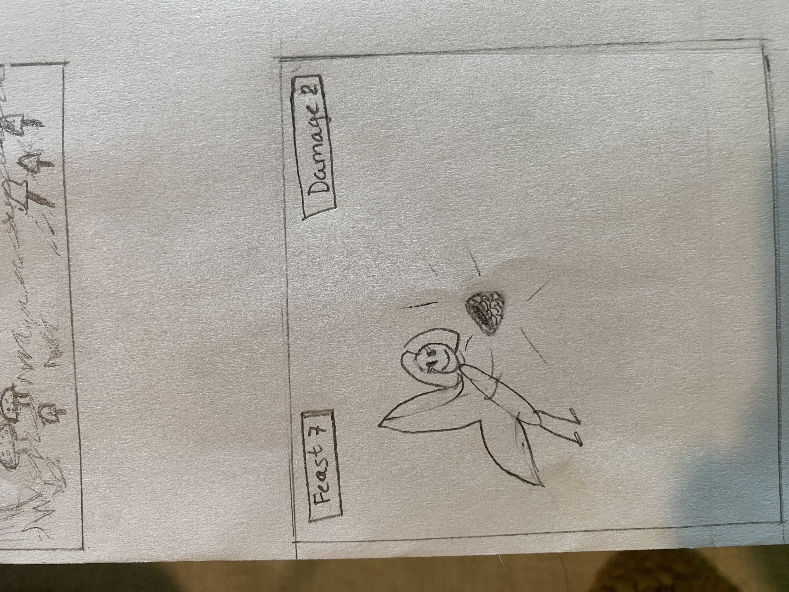
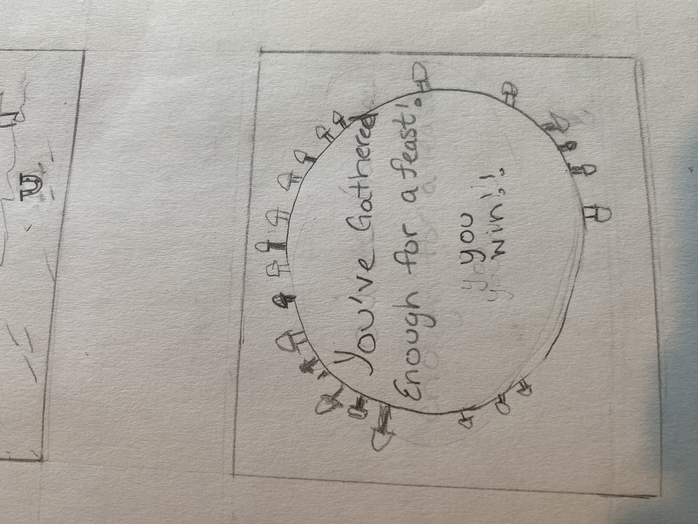
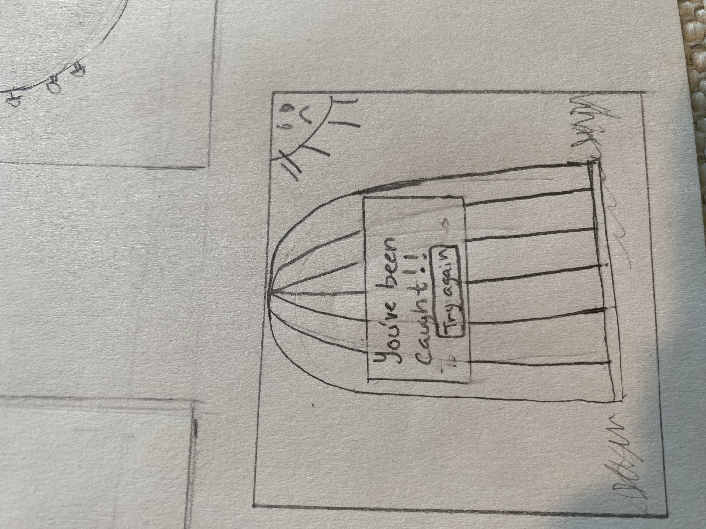

# project-1-fairy-feast

# Over View:
Fairy Feast is a user based interactive game where the user/ fairy collects fairy foods (mushrooms/raspberries) while dodging a fairy capture (horseshoe/nets)! Getting to 10pts "Feast" (mushrooms/raspberries) Wins the game and the fairy getes a feast. Getting 10pts in "Damage" (horseshoes/nets) you lose and the fairy get captured. 

# User Stories:
As a user I want the ability to ...
-start game
-gather fairy food
-dodge damaging items 
-collect 10 pts fairy food
-win game
-collect 10pts damage items 
-lose game

# 
# Wire Frames

